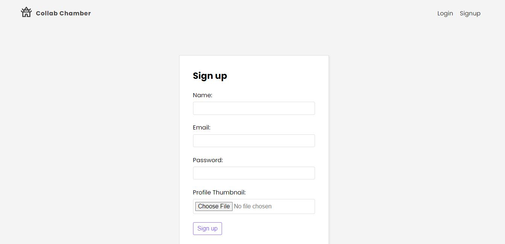
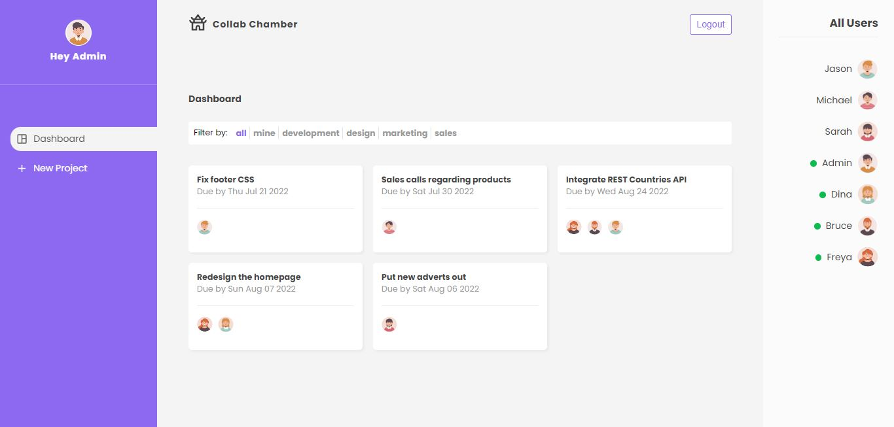
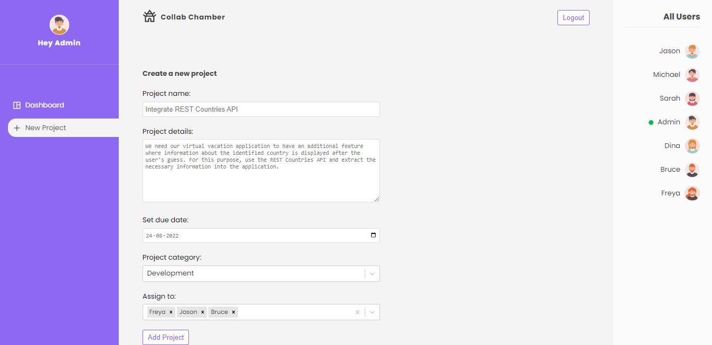
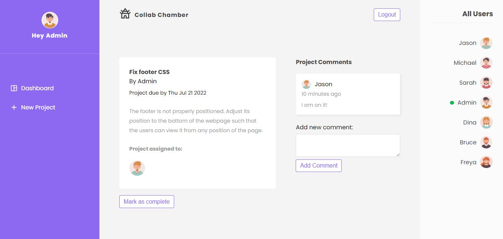
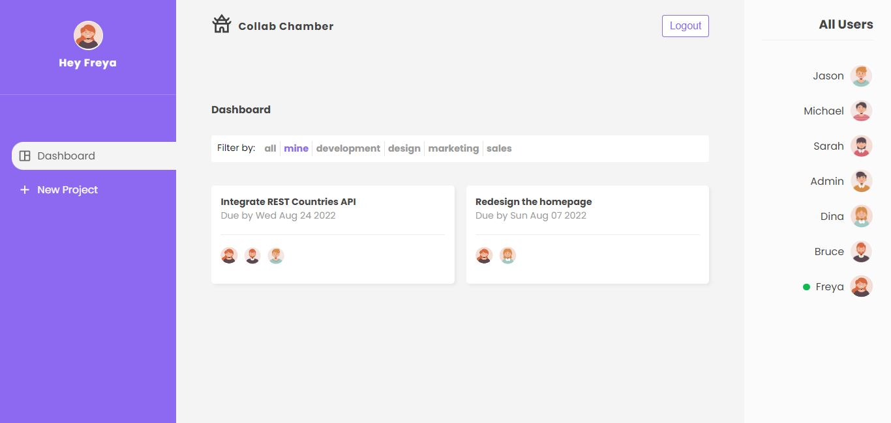

### Collab Chamber

This is a project management application designed to make collaboration within teams easier and more efficient. The project admin is provided with many useful features to accomodate better teamwork within their team members. 
Collab Chamber uses React Router to navigate across the home, create, projects, login and signup pages. Various hooks are used in order to interact with firebase authentication and database services. 

### Features 

1. Signup (with avatar), login and logout.
2. View dashboard (by default) and option to add new project in the navbar.
3. View list of users in the sidebar (alongside a green symbol for online users).
4. Create new projects using the "New Project" option (ame, details, due date, category, assign to).
5. View list of all projects in the dashboard.
6. Allow users to view project details upon click a project item in the dashboard.
7. Allow users to add comments in the project details pages.
8. Allow admin to mark a project as completed once done.
9. Filter the dashboard (all, assigned to me, individual categories).

### Preview

Signup

Dashboard

Add New Project

View project details

Filter according to project assigned to a specific user

